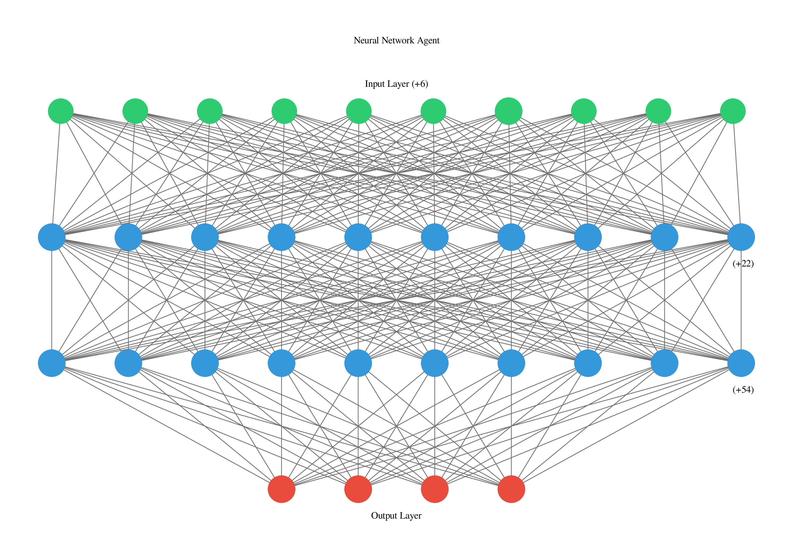
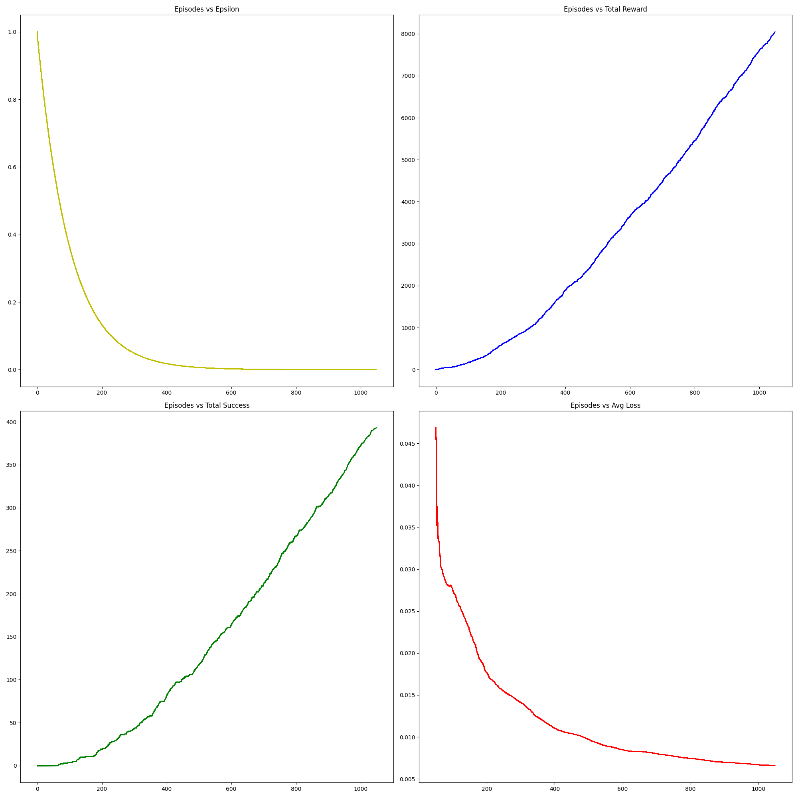
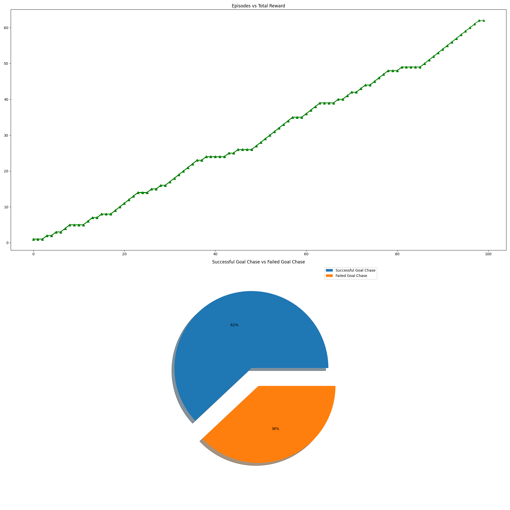
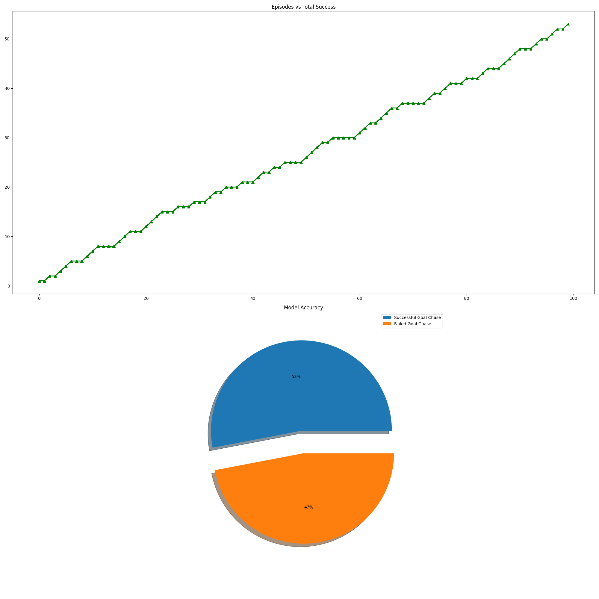
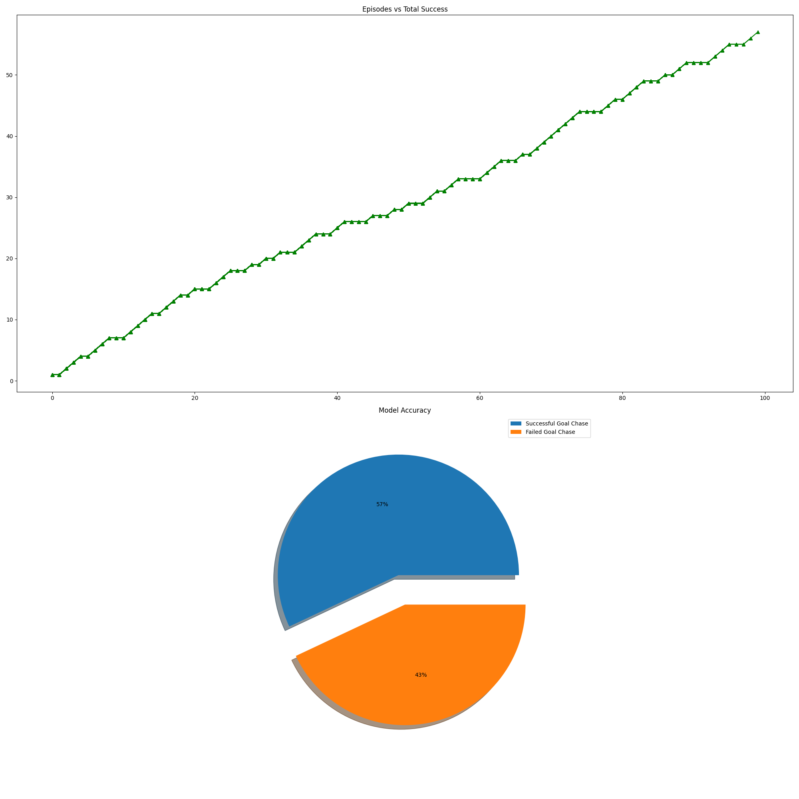
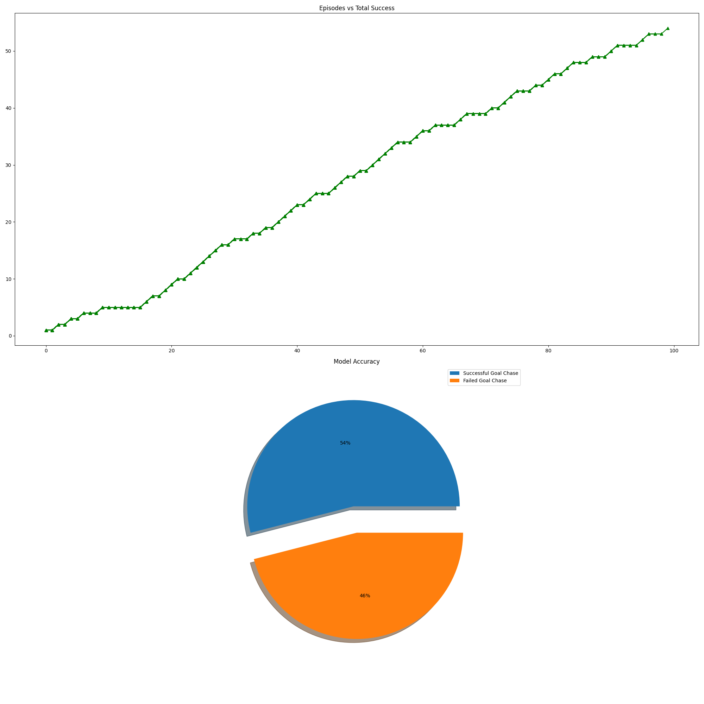
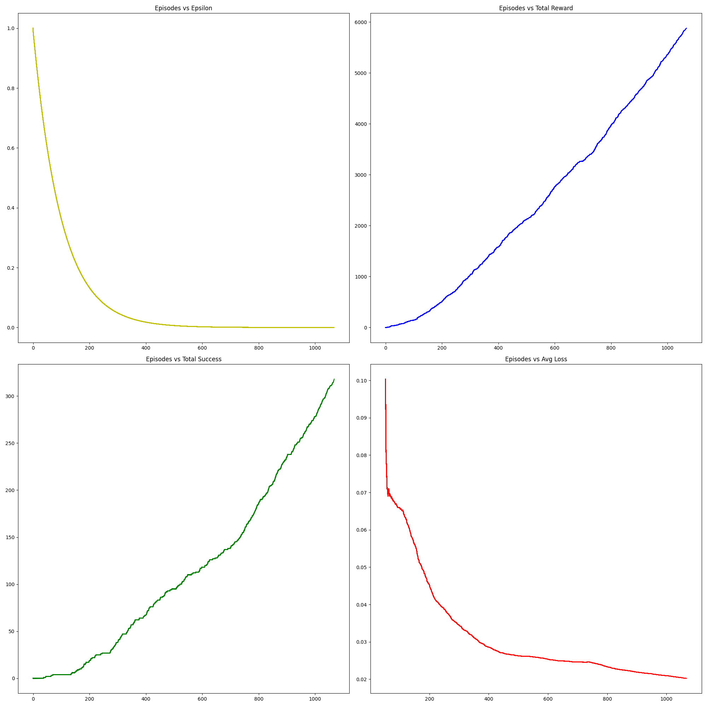
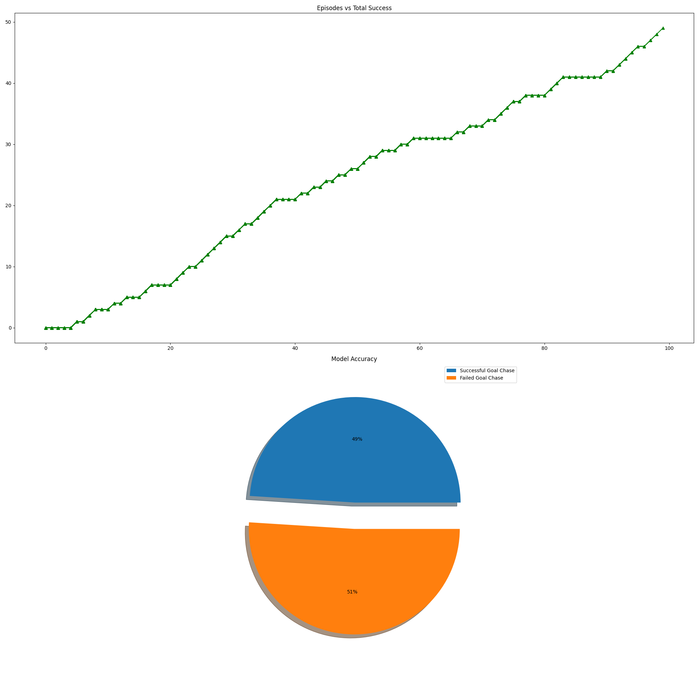
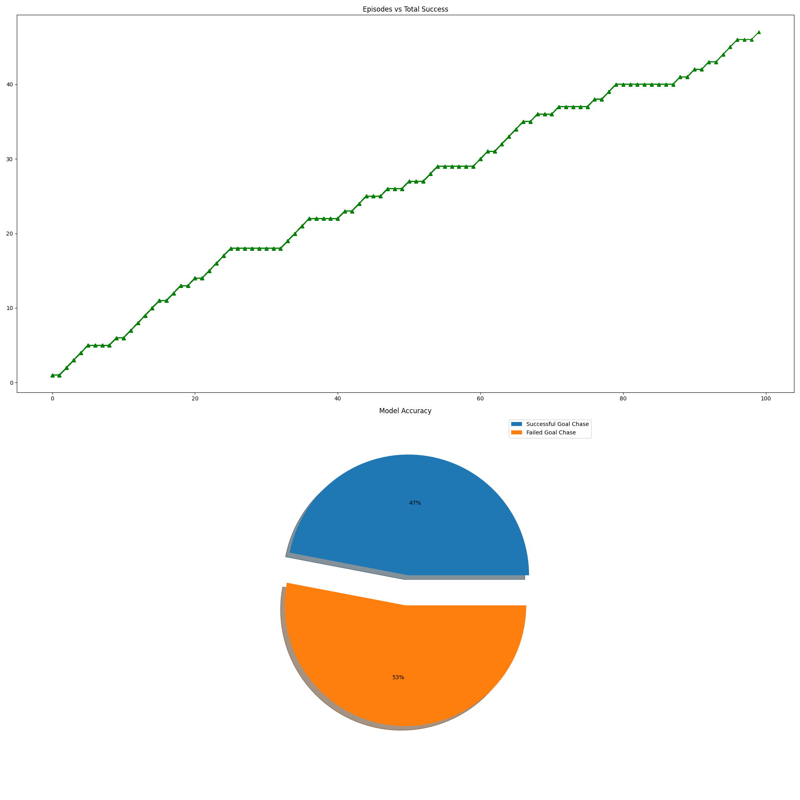
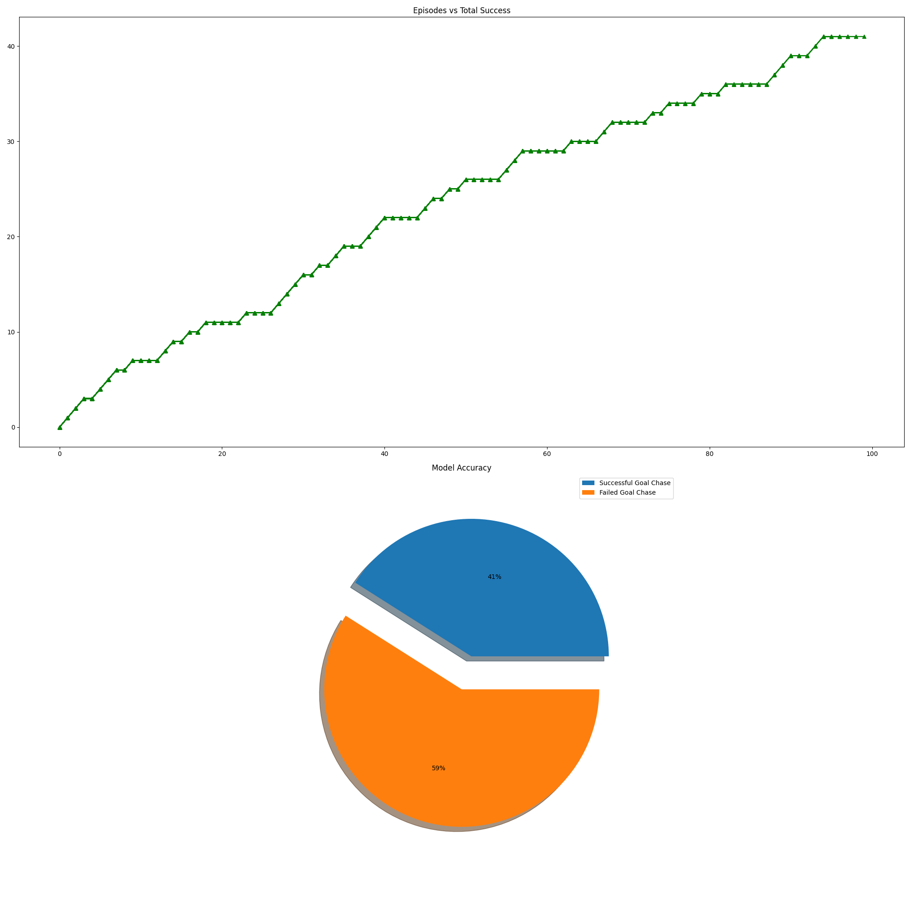

# FrozenLake-v1 Deep Q-Learning

This repository branch provides pre-trained agents (models) as well as easy-to-use customised code for training and inferring an agent to play the [FrozenLake-v1](https://gym.openai.com/envs/FrozenLake-v0/) (Slippery), a Toy Text game built by [OpenAI](https://openai.com/) under [OpenAI Gym](https://gym.openai.com/) that officially is a toolkit for developing and comparing reinforcement learning algorithms.

## Table of Contents
* [DIY Guide](#i-diy-guide)
  * [System Requirements](#system-requirements)
  * [Installation and Setup](#installation-and-setup)
  * [Training Flow](#training-flow)
  * [Inference Flow](#inference-flow)
* [Pre-Trained Model Inference](#ii-pre-trained-model-inference)
  * [Model-1](#model-1)
    * [Model-1 Training Plots](#model-1-training-plots)
    * [Model-1 Inference](#model-1-inference-average-probsuccessful-chase--05633)
  * [Model-2](#model-2)
    * [Model-2 Training Plots](#model-2-training-plots)
    * [Model-2 Inference](#model-2-inference-average-probsuccessful-chase--04367)
  * [Conclusion](#conclusion)
  * [Future Scope for Development](#future-scope-for-improvement)
* [Change Logs](#change-logs)


## I. DIY Guide

### System Requirements
* Linux or Mac OS
* Python 3.6 or above

### Installation and Setup
* Install dependencies using [requirements.txt](requirements.txt)
```
    pip install -r requirements.txt
```

### Training Flow
* #### Pre-Training Steps
  * Edit the following params from [FrozenLakeDQN.yml](config/FrozenLakeDQN.yml) :
    * ENVIRONMENT:
      * ```env_name```: 'FrozenLake-v1' 
      
      * ```custom_map_flag```: False 
      
      * ```custom_map```: [
          'SFFHF',
          'HFHFF',
          'HFFFH',
          'HHHFH',
          'HFFFG'
         ]  # Define custom_map of n x n dimensions only if custom_map_flag is set True
         
      * ```render_flag```: False
      
      * ```rewards```:  # Customized rewards to the agent for better training flow
      
        * ```positive_step_reward```: 0.25 &emsp; # Reward for ending up on FROZEN surface 
        
        * ```negative_step_reward```: -1.0 &emsp; # Reward for ending up in HOLE 
        
        * ```goal_step_reward```: 1.0 &emsp; &emsp; # Reward for ending up to GOAL

    * AGENT:
      * ```total_episodes```: 50000 
      
      * ```gamma```: 0.97 
      
      * ```epsilon```: 1.0 
      
      * ```min_epsilon```: 0.01 
      
      * ```training_data_deque_max_len```: 1000 &emsp; &emsp; # Max length for deque array that stores training data 
      
      * ```train_start_threshold```: 500 &emsp; &emsp; &emsp; # Starts training model after length of training_data_deque_max_len exceeds given value 
      
      * ```load_model_flag```: False 
      
      * ```model_path```: "" &emsp; &emsp; &emsp; &emsp; &emsp; &emsp; &emsp; &emsp; &emsp; &emsp; # Define model_path if load_model_flag is True

    * NN_MODEL:
      * ```neuron_units```: [32, 64]  &emsp; &emsp; &emsp; &emsp; &emsp; &emsp; # [hidden layer1, hidden layer2]
      * ```activations```: ['swish', 'swish', 'linear']  &emsp; # [layer1, layer2, output_layer] Refer https://keras.io/api/layers/activations/
      
      * ```kernel_initializers```: ['he_uniform', 'he_uniform', 'he_uniform']  &ensp; # Refer https://keras.io/api/layers/initializers/
      
      * ```loss```: 'mse'  &emsp; &emsp; &emsp; &emsp; &emsp; &ensp; &ensp; &emsp; &emsp; &emsp; &emsp; # Refer https://keras.io/api/losses/
      
      * ```learning_rate```: 0.01 
      
      * ```batch_size```: 32 
      
      * ```model_checkpoint```: 50  &emsp; &emsp; &emsp; &emsp; &emsp; &ensp; # Saves model after every given episodes

* #### Initiate Training
  * Run [FrozenLakeDQN.py](FrozenLakeDQN.py) using following command:
  ```
        python3 FrozenLakeDQN.py
  ```

* #### Post-Training Data Visualization
  * Training plots, training logs, and trained models can be found here:
    * [Training Logs](Training/TrainingLogs/FrozenLakeDQN)
    * [Training Plots](Training/TrainingPlots/FrozenLakeDQN)
    * [Trained Models](Training/TrainedModels/FrozenLakeDQN)


### Inference Flow
* #### Initiate Training
  * Run [FrozenLakeDQNInference.py](FrozenLakeDQNInference.py) using following command:
  ```
    python3 FrozenLakeDQNInference.py <path_to_model>
  ```

* #### Post-Inference Data Visualization
  * Inference plots and logs can be found here:
    * [Training Logs](Inference/InferenceLogs/FrozenLakeDQN)
    * [Training Plots](Inference/InferencePlots/FrozenLakeDQN)

**Note**: Name format for training and inference data files is : ```env_name``` + ```_``` + instantaneous_timestamp. Eg:- FrozenLake-v1_15-Sep-2021_21-30-35

## II. Pre-Trained Model Inference




## Model-1
* [Model-1](Training/TrainedModels/FrozenLakeDQN/FrozenLake-v1_14-Sep-2021_20-01-42.h5) is trained considering the parameters from [FrozenLakeDQN.yml](config/FrozenLakeDQN.yml) from [FrozenLakeDQN-M1_v1.0](https://github.com/kakadeniranjan1999/Reinforcement-Learning-With-OpenAI-Gym/releases/tag/FrozenLakeDQN-M1) release.
### Model-1 Training Plots
* Epochs = 1050 &emsp; Total reward = 8064.75 &emsp; Total success = 393 &emsp; Avg Loss:0.00657 &emsp; Training Logs = [FrozenLake-v1_14-Sep-2021_20-01-42.log](Training/TrainingLogs/FrozenLakeDQN/FrozenLake-v1_14-Sep-2021_20-01-42.log) &emsp; Trained Model = [FrozenLake-v1_14-Sep-2021_20-01-42.h5](Training/TrainedModels/FrozenLakeDQN/FrozenLake-v1_14-Sep-2021_20-01-42.h5)

* 

### Model-1 Inference [Average Prob(Successful Chase) = 0.5633]
#### Inference-1 &emsp; Prob(Successful Chase) = 0.62 &emsp; Inference Logs = [FrozenLake-v1_15-Sep-2021_21-30-35.log](Inference/InferenceLogs/FrozenLakeDQN/FrozenLake-v1_15-Sep-2021_21-30-35.log)


#### Inference-2 &emsp; Prob(Successful Chase) = 0.53 &emsp; Inference Logs = [FrozenLake-v1_15-Sep-2021_22-19-45.log](Inference/InferenceLogs/FrozenLakeDQN/FrozenLake-v1_15-Sep-2021_22-19-45.log)


#### Inference-3 &emsp; Prob(Successful Chase) = 0.56 &emsp; Inference Logs = [FrozenLake-v1_15-Sep-2021_22-29-48.log](Inference/InferenceLogs/FrozenLakeDQN/FrozenLake-v1_15-Sep-2021_22-29-48.log)


#### Inference-4 &emsp; Prob(Successful Chase) = 0.57 &emsp; Inference Logs = [FrozenLake-v1_15-Sep-2021_22-40-40.log](Inference/InferenceLogs/FrozenLakeDQN/FrozenLake-v1_15-Sep-2021_22-40-40.log)


#### Inference-5 &emsp; Prob(Successful Chase) = 0.56 &emsp; Inference Logs = [FrozenLake-v1_15-Sep-2021_22-50-30.log](Inference/InferenceLogs/FrozenLakeDQN/FrozenLake-v1_15-Sep-2021_22-50-30.log)


#### Inference-6 &emsp; Prob(Successful Chase) = 0.54 &emsp; Inference Logs = [FrozenLake-v1_15-Sep-2021_23-07-21.log](Inference/InferenceLogs/FrozenLakeDQN/FrozenLake-v1_15-Sep-2021_23-07-21.log)



## Model-2
* [Model-2](Training/TrainedModels/FrozenLakeDQN/FrozenLake-v1_16-Sep-2021_15-53-31.h5) is trained considering the parameters from [FrozenLakeDQN.yml](config/FrozenLakeDQN.yml) from [FrozenLakeDQN-M2_v1.0](https://github.com/kakadeniranjan1999/Reinforcement-Learning-With-OpenAI-Gym/releases/tag/FrozenLakeDQN-M2) release.

### Model-2 Training Plots
* Epochs = 1050 &emsp; Total reward = 5883.25 &emsp; Total success = 318 &emsp; Avg Loss:0.02022 &emsp; Training Logs = [FrozenLake-v1_16-Sep-2021_15-53-31.log](Training/TrainingLogs/FrozenLakeDQN/FrozenLake-v1_16-Sep-2021_15-53-31.log) &emsp; Trained Model = [FrozenLake-v1_16-Sep-2021_15-53-31.h5](Training/TrainedModels/FrozenLakeDQN/FrozenLake-v1_16-Sep-2021_15-53-31.h5)

* 

### Model-2 Inference [Average Prob(Successful Chase) = 0.4367]
#### Inference-1 &emsp; Prob(Successful Chase) = 0.41 &emsp; Inference Logs = [FrozenLake-v1_16-Sep-2021_20-07-42.log](Inference/InferenceLogs/FrozenLakeDQN/FrozenLake-v1_16-Sep-2021_20-07-42.log)


#### Inference-2 &emsp; Prob(Successful Chase) = 0.49 &emsp; Inference Logs = [FrozenLake-v1_16-Sep-2021_20-12-30.log](Inference/InferenceLogs/FrozenLakeDQN/FrozenLake-v1_16-Sep-2021_20-12-30.log)


#### Inference-3 &emsp; Prob(Successful Chase) = 0.47 &emsp; Inference Logs = [FrozenLake-v1_16-Sep-2021_20-19-58.log](Inference/InferenceLogs/FrozenLakeDQN/FrozenLake-v1_16-Sep-2021_20-19-58.log)


#### Inference-4 &emsp; Prob(Successful Chase) = 0.41 &emsp; Inference Logs = [FrozenLake-v1_16-Sep-2021_20-37-27.log](Inference/InferenceLogs/FrozenLakeDQN/FrozenLake-v1_16-Sep-2021_20-37-27.log)


#### Inference-5 &emsp; Prob(Successful Chase) = 0.42 &emsp; Inference Logs = [FrozenLake-v1_16-Sep-2021_20-40-43.log](Inference/InferenceLogs/FrozenLakeDQN/FrozenLake-v1_16-Sep-2021_20-40-43.log)


#### Inference-6 &emsp; Prob(Successful Chase) = 0.42 &emsp; Inference Logs = [FrozenLake-v1_16-Sep-2021_20-45-34.log](Inference/InferenceLogs/FrozenLakeDQN/FrozenLake-v1_16-Sep-2021_20-45-34.log)


### Conclusion
#### From all the above inferences, it can be concluded that:
  * Model-1 using swish activation function for hidden layers is found to be fast learner than Model-2 using relu activation for hidden layers.

### Future Scope for Improvement
#### Further improvements can be obtained using:
  * Model optimization using optimization techniques
  * Training agent with different configurations (maybe best possible) from [FrozenLakeDQN.yml](config/FrozenLakeDQN.yml)
  * Further training of the pretrained models


## Change Logs
* Implementation of Q-Learning for FrozenLake-v1
* Implementation of Deep Q-Learning for FrozenLake-v1
* Added custom map support for FrozenLake-v1 environment
* Trained Model-1 considering configurations from [FrozenLakeDQN.yml](config/FrozenLakeDQN.yml) from [FrozenLakeDQN-M1_v1.0](https://github.com/kakadeniranjan1999/Reinforcement-Learning-With-OpenAI-Gym/releases/tag/FrozenLakeDQN-M1) release
* Trained Model-2 considering configurations from [FrozenLakeDQN.yml](config/FrozenLakeDQN.yml) from [FrozenLakeDQN-M2_v1.0](https://github.com/kakadeniranjan1999/Reinforcement-Learning-With-OpenAI-Gym/releases/tag/FrozenLakeDQN-M2) release


